#  Synapse

**The memory layer that learns.** A self-hosted knowledge system that captures AI engineering sessions, extracts atomic facts, builds a knowledge graph, detects contradictions, and provides sub-200ms 4-signal retrieval that improves with every interaction.

**Also optimizes the cost of every LLM interaction** — context compression, verbosity steering, and effort routing reduce token usage 30–60% while maintaining answer quality.

## What Synapse Does

| Capability | How |
|-----------|-----|
| **Capture** | Passive/active sessions, git PRs/commits, Slack, MCP, SDKs, **documents (PDF, images, diagrams)** |
| **Extract** | Heuristic fact extraction → typed entities (decision, lesson, pattern, constraint, opinion) |
| **Graph** | Auto-populated knowledge graph with co-occurrence edges and importance scoring |
| **Search** | 4-signal hybrid: semantic (pgvector), keyword (FTS), entity overlap, graph neighbors |
| **Temporal** | **Version chains track fact evolution, point-in-time queries, change frequency analysis** |
| **Learn** | LLM-powered reflection, confidence calibration, contradiction detection, adaptive ranking |
| **Compact** | Automatic session summarization via LLM, cross-session deduplication |
| **Optimize** | Context compression (30–60%), verbosity steering, effort routing for LLM calls |
| **Share** | Cross-agent shared context with deduplication for multi-tool workflows |
| **Observe** | Prometheus `/metrics`, token cost attribution, structured audit log, queue visibility |
| **Benchmark** | **Built-in evaluation suite: 94.2% Recall@5 on LongMemEval, 86.0% on BEAM** |
| **Wrap** | Zero-config setup: `synapse wrap claude` / `cursor` / `kiro` / `codex` |

## Architecture

Single Go binary + Flutter admin UI + optional Rust compute kernels.

```
┌─────────────────────────────────────────────────────────────────────┐
│                         CAPTURE LAYER                                │
│  MCP │ Python SDK │ JS SDK │ CLI │ Git │ Slack │ REST API           │
└──────┬──────────────────────────────────────────────────────────────┘
       │
┌──────▼──────────────────────────────────────────────────────────────┐
│                         API SERVER (Go)                              │
│  Auth (Login/OIDC/API Keys) │ Rate Limiting │ Webhooks              │
│  Search (4-signal) │ Reflect │ Admin │ Prometheus                   │
└──────┬──────────────────────────────────────────────────────────────┘
       │
┌──────▼──────────────────────────────────────────────────────────────┐
│                         WORKER                                       │
│  Segment → Embed → Facts → Dedup → Graph → Contradictions → Index  │
│  Auto-compaction │ Confidence calibration │ Reaper recovery          │
└──────┬──────────────────────────────────────────────────────────────┘
       │
┌──────▼──────────────────────────────────────────────────────────────┐
│  PostgreSQL 16       │  Redis 7          │  S3/MinIO                │
│  pgvector + FTS      │  Queues + Cache   │  Raw Objects             │
│  Knowledge Graph     │  Rate State       │  Session Payloads        │
└─────────────────────────────────────────────────────────────────────┘
```



## Data Flow



## Quick Start

```bash
# Solo mode (single developer, zero dependencies)
synapse solo init
synapse solo
# API at http://localhost:3333, no PostgreSQL/Redis/S3 needed

# Zero-config agent setup (recommended for teams)
synapse wrap claude    # or: cursor, kiro, codex, vscode
# That's it — your agent now has 11 MCP tools for search, capture, reflect, and more.

# Docker Compose (includes all dependencies)
docker compose -f infra/docker/docker-compose.yml up --build

# Bootstrap admin
docker compose exec api env AUTH_BOOTSTRAP_EMAIL=admin@synapse.local \
  AUTH_BOOTSTRAP_PASSWORD=ChangeMeNow123 /usr/local/bin/synapse auth-bootstrap

# Open UI
open http://localhost:8080
```

See [docs/GETTING-STARTED.md](docs/GETTING-STARTED.md) for native installation, [docs/SOLO-MODE.md](docs/SOLO-MODE.md) for personal use.

## Client SDKs

```python
# Python
from synapse_sdk import SynapseClient, SessionTracker
client = SynapseClient(token="sk_synapse_...")
results = client.search("How does our auth work?")
```

```javascript
// JavaScript (Node 18+)
const { SynapseClient } = require('@synapse/sdk');
const client = new SynapseClient({ token: 'sk_synapse_...' });
const results = await client.search('Redis caching strategy');
```

## MCP Tools (11 tools)

`search_knowledge` · `get_context` · `get_facts` · `get_fact_history` · `reflect_on_knowledge` · `save_session` · `save_insight` · `capture_git` · `graph_entity` · `graph_path` · `feedback`

## Admin Panel

The Flutter web UI provides: Dashboard, Users & Roles, Teams, System Health, Activity Metrics, Configuration (LLM), Memory Browser, Knowledge Search, Graph Explorer, API Keys, Operations (queues/audit/backup), and an Onboarding Wizard.

## Cost Optimization

Synapse reduces LLM token costs automatically:

| Optimization | Where Applied | Savings |
|-------------|---------------|---------|
| Context compression | Compaction, Reflect | 30–60% input tokens |
| Verbosity steering | All internal LLM calls | 30–40% output tokens |
| Effort routing | Routine vs complex tasks | Right-sized max_tokens |
| Cross-agent dedup | Shared context store | Avoids redundant processing |

## Knowledge Quality (improves over time)

| Mechanism | Effect |
|-----------|--------|
| Contradiction detection | Auto-supersedes conflicting facts |
| Confidence calibration | Unused decays, accessed strengthens |
| Feedback → ranking | Upvotes/downvotes tune signal weights |
| Temporal decay | 30-day half-life keeps knowledge fresh |
| Session learning | Failure patterns mined for recommendations |

## Key Design Decisions

- **Embedded migrations** with advisory locking and checksums, schema is always reproducible
- **Request-context DI**: no mutable globals, testable handlers
- **Rotating refresh sessions** HttpOnly cookies with replay revocation
- **Team/repo isolation** enforced in SQL, not just UI
- **Temporal decay** 30-day half-life keeps recent knowledge prominent
- **Contradiction detection** cosine >0.85 + identical entities auto-supersedes

## Documentation

- [API Reference](docs/API.md)
- [Architecture](ARCHITECTURE.md)
- [Benchmarks](docs/BENCHMARKS.md)
- [Solo Mode](docs/SOLO-MODE.md)
- [Installation](docs/INSTALLATION.md)
- [Getting Started](docs/GETTING-STARTED.md)
- [Deployment](docs/DEPLOYMENT.md)
- [Data Flow Diagrams](docs/diagrams/README.md)
- [Changelog](CHANGELOG.md)

## Deployment Modes

| Mode | Use Case | Dependencies | Command |
|------|----------|-------------|---------|
| **Solo** | Individual developer | None (embedded storage) | `synapse solo` |
| **Docker Compose** | Small team, quick start | Docker | `docker compose up` |
| **Native** | Single server | PostgreSQL, Redis, S3 | `deploy/install.sh` |
| **Kubernetes** | Production, multi-node | K8s cluster | `helm install synapse` |
| **Terraform** | Cloud infrastructure | AWS/GCP account | `terraform apply` |

## Benchmarks

Synapse includes a built-in benchmarking framework. Results on the 4-signal hybrid engine:

| Metric | LongMemEval | BEAM |
|--------|-------------|------|
| Recall@5 | 94.2% | 86.0% |
| MRR | 0.874 | 0.820 |
| Avg Latency | 48ms | 89ms |

Run with: `synapse benchmark --dataset longmemeval`

See [docs/BENCHMARKS.md](docs/BENCHMARKS.md) for full results and methodology.

## Version

**v1.2.0** — See [CHANGELOG.md](CHANGELOG.md) for full history.
