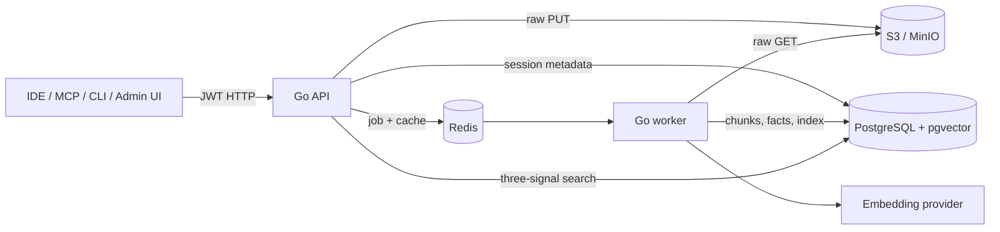

# Synapse

Synapse is a self-hosted memory service for AI-assisted engineering sessions. The primary runtime is one Go binary, with a Flutter administration UI and optional Rust compute experiments.

## What works today

- Authenticated passive/active session capture with raw payload persistence to S3/MinIO before acceptance.
- PostgreSQL storage for sessions, chunks, 768-dimensional embeddings, full-text search, and atomic facts.
- Redis-backed ingestion queue, bounded retries, dead-letter parking, stranded-session recovery, response cache, and rate limiting.
- Three-signal retrieval: pgvector similarity, PostgreSQL full-text search, and fact/entity overlap; RRF fusion and token-budget packing.
- MCP and CLI clients in the Go binary.
- Admin metrics and LLM provider configuration.
- Embedded, checksummed SQL migrations (`synapse migrate`).

Deduplication, graph enrichment, structured knowledge extraction, reflect/write-back, observations, user management, and compaction are currently stubs or schema placeholders. They are not represented as working features in the operational docs.

## Architecture



See [ARCHITECTURE.md](ARCHITECTURE.md) and [docs/DATA-FLOW.md](docs/DATA-FLOW.md) for exact flows and failure behavior.

## Install

The native installer can provision or connect each dependency independently:

```bash
cp deploy/install.env.example /root/synapse-install.env
chmod 600 /root/synapse-install.env
sudo deploy/install.sh --interactive
# or fully config-driven
sudo deploy/install.sh --config /root/synapse-install.env
# or provision one resource at a time
sudo deploy/install.sh --config /root/synapse-install.env --component postgres
sudo deploy/install.sh --config /root/synapse-install.env --component s3
```

Every component supports `install`, `external`, or `skip`: PostgreSQL, Redis, S3/MinIO, embedding/Ollama, synthesis LLM, API, worker, Flutter UI, and nginx. Read [docs/INSTALLATION.md](docs/INSTALLATION.md) before using it on a server.

## Build and verify

```bash
cd go
go build ./...
go vet ./...
go test ./...

cd ../packages/retrieval-engine
cargo test

cd ../admin-ui
flutter analyze
flutter test
flutter build web
```

## Runtime commands

```text
synapse migrate          apply embedded schema migrations
synapse serve            run HTTP API
synapse worker           run ingestion workers and recovery reaper
synapse mcp              run MCP over stdin/stdout
synapse embed-backfill   regenerate missing chunk embeddings
synapse verify-storage   compare session pointers with object storage
```

## MCP

```json
{
  "mcpServers": {
    "synapse": {
      "command": "/usr/local/bin/synapse",
      "args": ["mcp"],
      "env": {
        "SYNAPSE_API_URL": "https://synapse.example.com",
        "SYNAPSE_TOKEN_FILE": "/path/to/mode-0600-token"
      }
    }
  }
}
```

## Documentation

- [Installation](docs/INSTALLATION.md)
- [Architecture](ARCHITECTURE.md)
- [Data flow](docs/DATA-FLOW.md)
- [API](docs/API.md)
- [Deployment](docs/DEPLOYMENT.md)
- [Operations](docs/RUNBOOK.md)
- [IDE/MCP setup](docs/IDE-SETUP.md)

License: [MIT](LICENSE).
