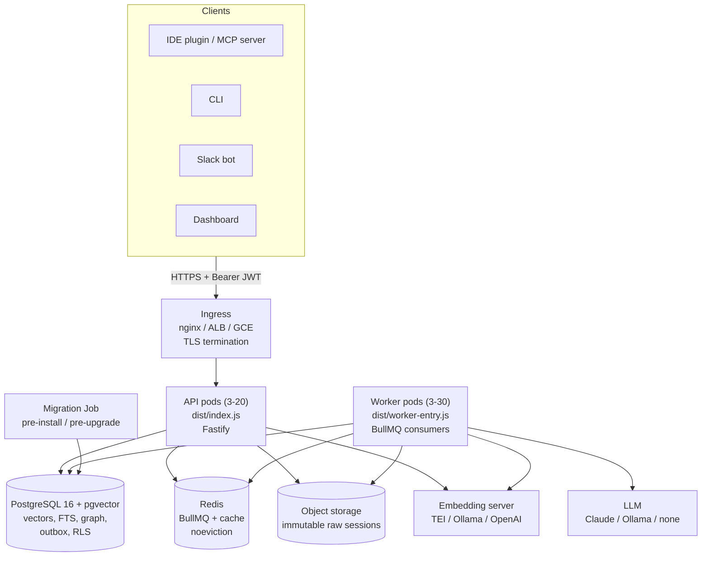
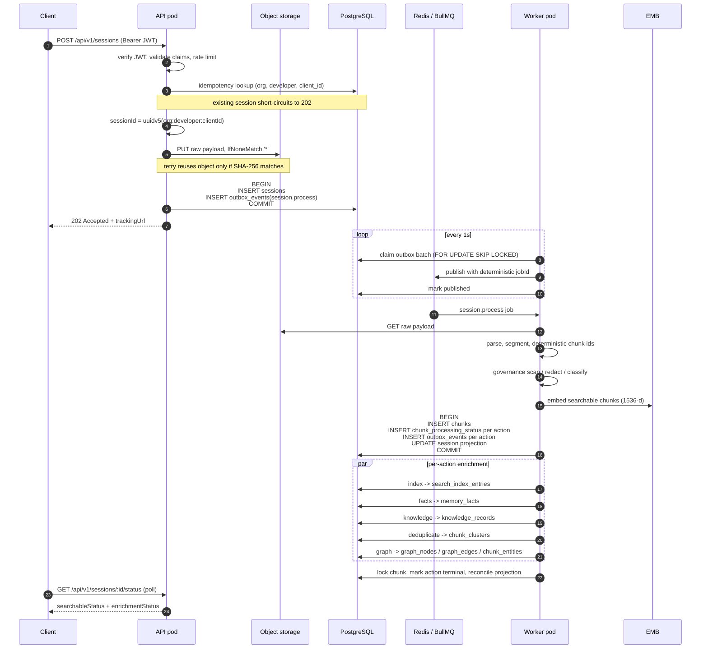
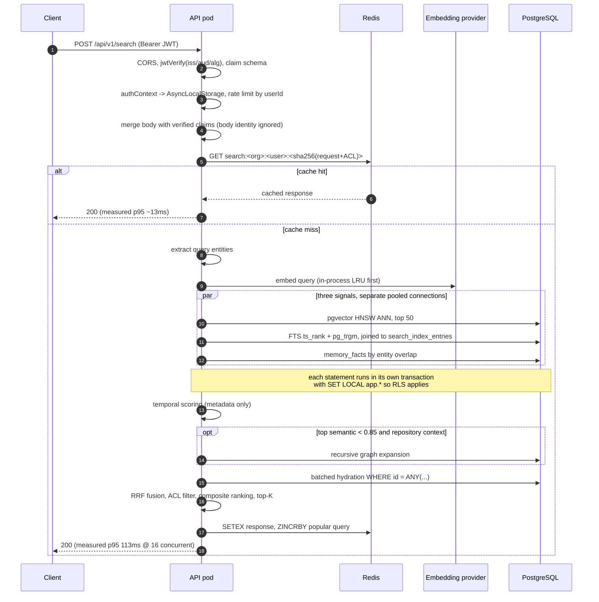
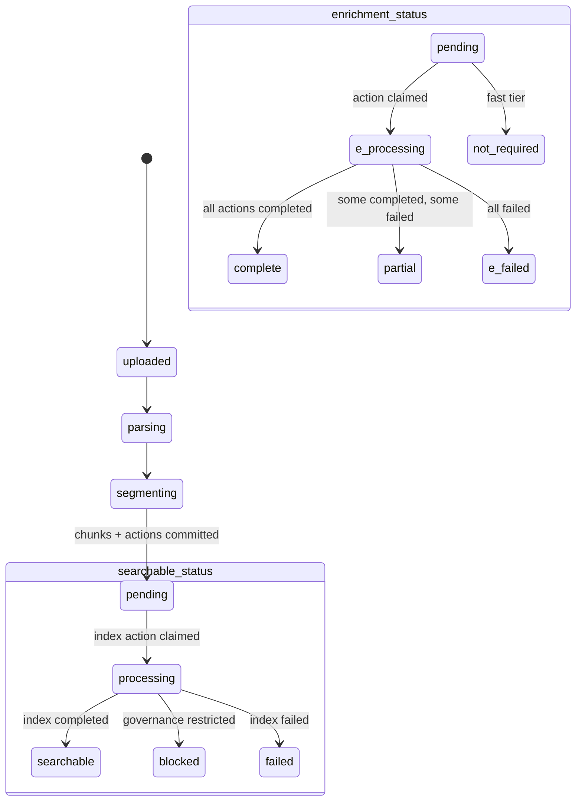
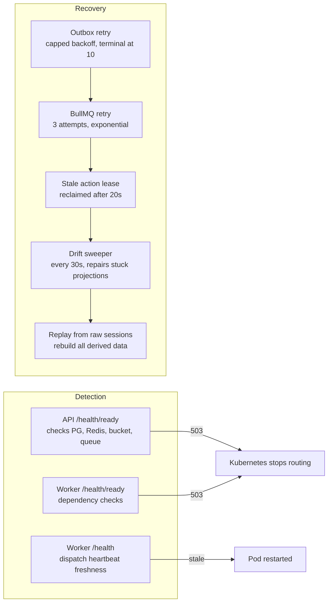

# Data Flow

How data actually moves through Recall. Everything here reflects the running
code, not intent. Where a step is unimplemented it is marked.

Related: [ARCHITECTURE.md](../ARCHITECTURE.md) for design rationale,
[DEPLOYMENT.md](DEPLOYMENT.md) for topology, [RUNBOOK.md](RUNBOOK.md) for
operations.

---

## 1. Node topology

Workers accept no inbound application traffic. They expose only
`:3001/health` and `:3001/health/ready` for probes. The migration Job runs
with a distinct, more privileged database credential than the runtime pods.

---

## 2. Write path: session upload

Synchronous portion ends at the 202. Everything after is durable and
asynchronous.

Key invariants:

- **Nothing is enqueued in the request path.** Database state and queue intent
  commit in one transaction, so a Redis outage cannot lose accepted work.
- **Raw sessions are immutable.** They are the rebuild source for every derived
  artifact.
- **Identity is deterministic.** Session, chunk, fact, and knowledge ids are
  UUIDv5, so replay is idempotent rather than duplicating.
- **Governance is a hard gate.** Restricted chunks are stored redacted and
  owner-only with no embedding, no indexing, and no enrichment.
- **Every status transition locks the chunk row first.** Without it, concurrent
  action completions each fail to observe the others and the projection sticks
  at `processing` forever. Covered by
  `tests/integration/processing-status-concurrency.test.ts`.

---

## 3. Read path: search

Two independent authorization layers apply: PostgreSQL row-level security using
the transaction-local claims, and an application ACL filter that also drops
`restricted` classifications. Cache keys hash the full request **including** ACL
context, so two users with different permissions can never share an entry.

### Measured retrieval performance

221-chunk corpus, single API process, cache cleared between runs:

| Concurrency | p50 | p95 | p99 | rps |
|---|---|---|---|---|
| 1 | 10.2ms | 13.1ms | 17.7ms | 95 |
| 8 | 40.0ms | 61.1ms | 76.1ms | 195 |
| 16 | 80.4ms | 113.1ms | 138.1ms | 198 |
| warm cache | 8.1ms | 12.8ms | — | ~1830 |

Throughput saturates near 198 rps per process. Beyond that, added latency is
event-loop queueing, so capacity comes from replicas. Reproduce with
`npm run load:retrieval`.

Retrieval deliberately **omits the embedding column** from its projections. A
1536-dimension vector is ~15KB of text per row and roughly 120 candidates are
hydrated per query; parsing them cost ~14ms of CPU per request and nothing
downstream reads them, since similarity is computed in SQL.

---

## 4. Status model

Searchability and enrichment advance independently, so content becomes
retrievable without waiting for deep processing.

`blocked` is a success state for governance, not an error: the chunk is retained
redacted and owner-only.

---

## 5. Failure and recovery paths

Verified behaviour: stopping PostgreSQL leaves worker liveness healthy while
readiness returns 503, and the worker recovers without a restart. A dependency
outage must never escalate to process death, which is why the dispatch tick
never rejects.

---

## 6. Not implemented

Do not infer these from the diagrams:

- **No metrics or tracing.** No `/metrics` endpoint, no OpenTelemetry SDK.
  `OTEL_EXPORTER_OTLP_ENDPOINT` is injected but unread. Every operational check
  in the runbook is manual.
- **No alerting on terminal failures.** Outbox events go `failed` after 10
  attempts and action rows can end `failed`; the sweeper repairs stuck
  projections but nothing pages anyone about genuine failures.
- **No ingestion backpressure.** Uploads are accepted 202 with no per-tenant
  quota or queue-depth admission control. With `noeviction`, a sustained burst
  exhausts Redis memory and writes begin to fail. This has been reproduced:
  a load test filled a 256MB instance and produced 6,168 silent cache-write
  failures.
- **No cross-region DR.** No replica promotion, no bucket replication, no DNS
  failover. Recovery relies on replaying immutable raw sessions.
- **Compaction and pruning are partial.** `runMonthlyPruning` and
  `getCompactionMetrics` return stubs, and there are no `/internal/jobs/*`
  endpoints.
