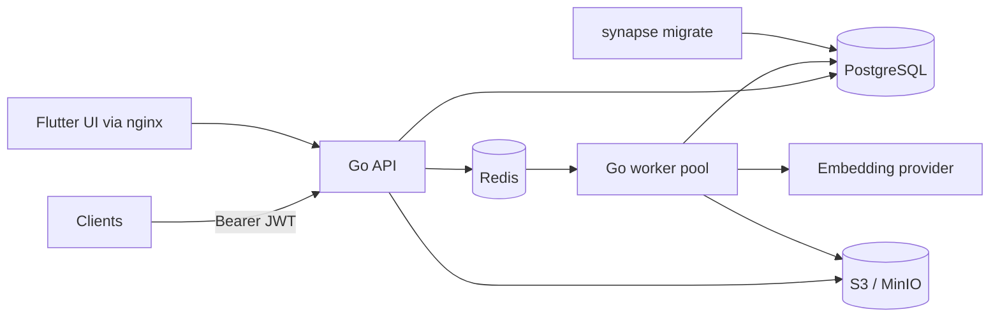
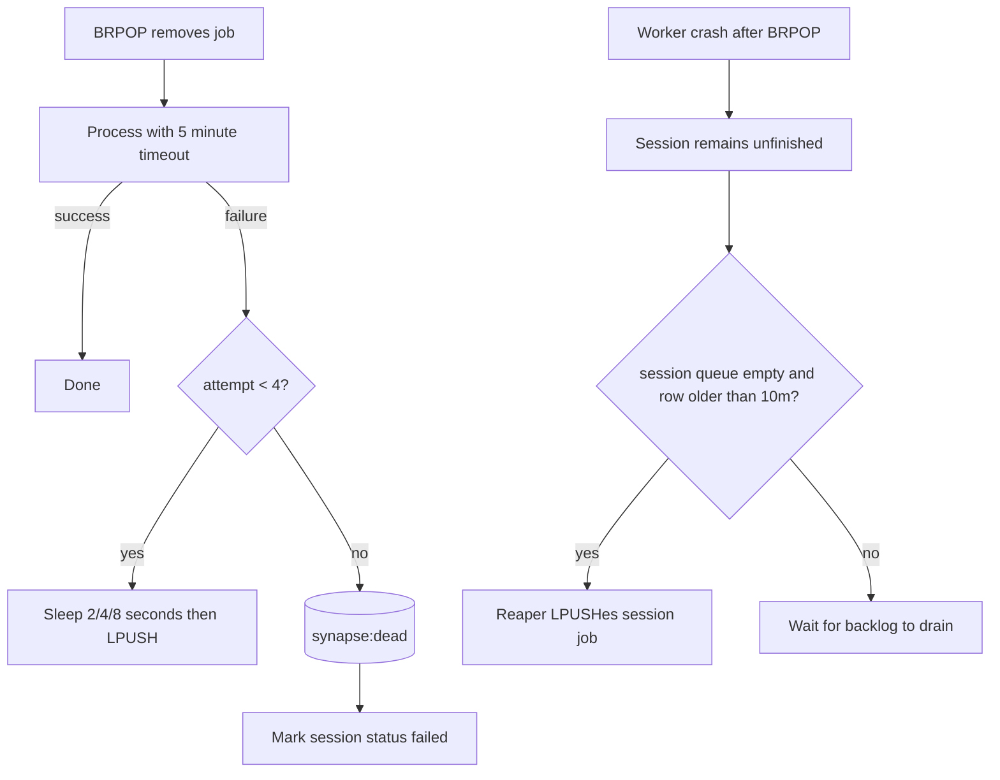
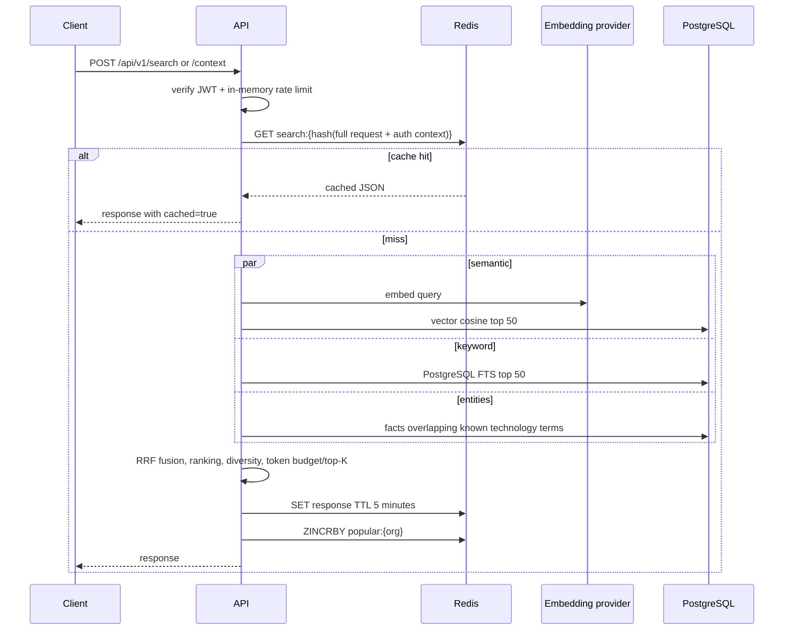

# Data Flow

This is the implemented Go flow. Standalone Mermaid sources are in [`docs/diagrams`](diagrams/README.md).

## Topology



## Capture/write path

```mermaid
sequenceDiagram
  participant C as Client
  participant A as API
  participant O as S3/MinIO
  participant P as PostgreSQL
  participant R as Redis
  participant W as Worker
  participant E as Embedding provider

  C->>A: POST /api/v1/capture/passive or active
  A->>A: verify JWT, require sub/org, validate >=2 messages
  A->>O: PUT sessions/{org}/{uuid}.json
  alt raw PUT fails
    A-->>C: 503; caller may retry
  end
  A->>P: INSERT sessions (processing/pending)
  alt row insert fails
    A-->>C: 503 (raw object may be orphaned)
  end
  A->>R: LPUSH synapse:session
  Note over A,R: enqueue failure is logged; durable row is recovered later
  A-->>C: 202 Accepted

  R->>W: BRPOP job (removes it from queue)
  W->>O: GET raw JSON
  W->>P: load session attribution
  W->>P: delete prior derived facts/chunks for retry
  W->>W: segment into approximately 800-1200-token chunks
  W->>E: batch embed chunks (768d)
  Note over W,E: provider failure stores chunks without vectors
  loop each chunk
    W->>P: INSERT chunk
    W->>E: batch embed heuristic facts
    W->>P: INSERT facts
    W->>P: UPSERT search_index_entries
  end
  W->>P: session = indexed/searchable
```

The raw write is synchronous because chunks are lossy. Session insert and queue push are not one transaction across PostgreSQL/Redis; the recovery reaper closes that gap. Session IDs are random UUIDs, so client retries create new sessions; capture idempotency is not implemented.

## Retry and recovery



The reaper deliberately skips while session work is queued, avoiding duplicate amplification during long backlogs. This means crash recovery can be delayed until the queue drains.

## Search/read path



Semantic failure degrades to keyword/entity retrieval. Keyword database errors are logged and currently also degrade rather than failing the request. `SearchRequest.filters` and `offset` are accepted but not applied. The popular-query sorted set has no consumer.

## Cache lifecycle

Search responses expire after five minutes. Reads do not refresh TTL. Expiry only removes the cached response; it has no relationship to ingestion and never moves session data into PostgreSQL or object storage. Raw captures populate durable stores; search merely caches derived responses. There is no write invalidation, so a response can remain stale for at most its remaining TTL.

## LLM settings flow

Admin-role requests can read/update `system_settings['llm']`, list Ollama models, and test providers. API keys are masked in responses but stored in PostgreSQL JSONB. The current `reflect` endpoint is a stub, so saved generation settings are not consumed by a production reasoning flow.

## Status values

Implemented capture starts with `status=processing`, `searchable_status=pending`, `enrichment_status=pending`. Successful worker processing sets `status=indexed` and `searchable_status=searchable`; enrichment remains pending. Exhausted session retries set `status=failed`. The legacy status HTTP handler is a stub and must not be used as an authoritative state read.

## Metrics

Redis cache state is sampled from `SCAN`/`INFO`; object-store counters are aggregated in Redis. Retrieval latency and several ingestion counters are process-local and reset/reseed on restart. `GET /api/v1/stats/metrics` is an admin/dashboard JSON endpoint, not Prometheus.
